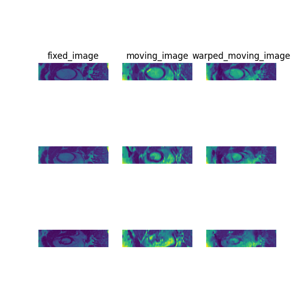

# Classical nonrigid registration for prostate MR images

> **Note**: Please read the
> [DeepReg Demo Disclaimer](introduction.html#demo-disclaimer).

[Source Code](https://github.com/DeepRegNet/DeepReg/tree/main/demos/classical_mr_prostate_nonrigid)

This is a special demo that uses the DeepReg package for classical nonrigid image
registration, which iteratively solves an optimisation problem. Gradient descent is used
to minimise the image dissimilarity function of a given pair of moving and fixed images,
often regularised by a deformation smoothness function.

## Author

DeepReg Development Team

## Application

Registering inter-subject prostate MR images may be useful to align different glands in
a common space for investigating the spatial distribution of cancer.

## Data

Data is an example MR volumes with the prostate gland segmentation from
[MICCAI Grand Challenge: Prostate MR Image Segmentation 2012](https://promise12.grand-challenge.org/).

## Instruction

### Installation

Please install DeepReg following the [instructions](../getting_started/install.html) and
change the current directory to the root directory of DeepReg project, i.e. `DeepReg/`.

### Download data

Please execute the following command to download and pre-process the data.

```bash
python demos/classical_mr_prostate_nonrigid/demo_data.py
```

### Launch registration

Please execute the following command to register two images. The optimised
transformation will be applied to the moving images, as well as the moving labels. The
results, saved in a timestamped folder under the project directory, will compare the
warped image/labels with the ground-truth image/labels.

```bash
python demos/classical_mr_prostate_nonrigid/demo_register.py
```

## Visualise

The following command can be executed to generate a plot of three image slices from the
the fixed image, moving image and warped image (left to right) to visualise the
registration. Please see the visualisation tool docs
[here](https://github.com/DeepRegNet/DeepReg/blob/main/docs/source/docs/visualisation_tool.md)
for more visualisation options such as animated gifs.

```bash
deepreg_vis -m 2 -i 'demos/classical_mr_prostate_nonrigid/logs_reg/fixed_image.nii.gz, demos/classical_mr_prostate_nonrigid/logs_reg/moving_image.nii.gz, demos/classical_mr_prostate_nonrigid/logs_reg/warped_moving_image.nii.gz' --slice-inds '4, 8, 12' -s demos/classical_mr_prostate_nonrigid/logs_reg
```

Note: The registration script must be run before running the command to generate the
visualisation.



## Contact

Please [raise an issue](https://github.com/DeepRegNet/DeepReg/issues/new/choose) for any
questions.

## Reference

[1] Litjens, G., Toth, R., van de Ven, W., Hoeks, C., Kerkstra, S., van Ginneken, B.,
Vincent, G., Guillard, G., Birbeck, N., Zhang, J. and Strand, R., 2014. Evaluation of
prostate segmentation algorithms for MRI: the PROMISE12 challenge. Medical image
analysis, 18(2), pp.359-373.
