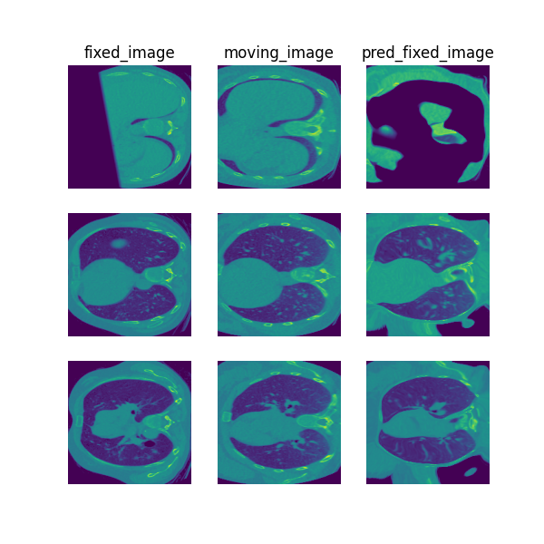

# Unpaired lung CT registration

> **Note**: Please read the
> [DeepReg Demo Disclaimer](introduction.html#demo-disclaimer).

[Source Code](https://github.com/DeepRegNet/DeepReg/tree/main/demos/unpaired_ct_lung)

## Author

DeepReg Development Team (Shaheer Saeed)

## Application

This is a registration between CT images from different patients. The images are all
from acquired at the same timepoint in the breathing cycle. This is an inter subject
registration. This kind of registration is useful for determining how one stimulus
affects multiple patients. If a drug or invasive procedure is administered to multiple
patients, registering the images from different patients can give medical professionals
a sense of how each patient is responding in comparison to others. An example of such an
application can be seen in [2].

## Data

The dataset for this demo comes from [1] and can be downloaded from:
https://zenodo.org/record/3835682#.XsUWXsBpFhE

## Instruction

### Installation

Please install DeepReg following the [instructions](../getting_started/install.html) and
change the current directory to the root directory of DeepReg project, i.e. `DeepReg/`.

### Download data

Please execute the following command to download/pre-process the data and download the
pre-trained model. Image intensities are rescaled during pre-processing.

```bash
python demos/unpaired_ct_lung/demo_data.py
```

### Launch demo training

Please execute the following command to launch a demo training. The training logs and
model checkpoints will be saved under `demos/unpaired_ct_lung/logs_train`.

```bash
python demos/unpaired_ct_lung/demo_train.py
```

Here the training is launched using the GPU of index 0 with a limited number of steps
and reduced size. Please add flag `--no-test` to use the original training
configuration, such as

```bash
python demos/unpaired_ct_lung/demo_train.py --no-test
```

### Predict

Please execute the following command to run the prediction with pre-trained model. The
prediction logs and visualization results will be saved under
`demos/unpaired_ct_lung/logs_predict`. Check the [CLI documentation](../docs/cli.html)
for more details about prediction output.

```bash
python demos/unpaired_ct_lung/demo_predict.py
```

Optionally, the user-trained model can be used by changing the `ckpt_path` variable
inside `demo_predict.py`. Note that the path should end with `.ckpt` and checkpoints are
saved under `logs_train` as mentioned above.

## Visualise

The following command can be executed to generate a plot of three image slices from the
the fixed image, moving image and warped image (left to right) to visualise the
registration. Please see the visualisation tool docs
[here](https://github.com/DeepRegNet/DeepReg/blob/main/docs/source/docs/visualisation_tool.md)
for more visualisation options such as animated gifs.

```bash
deepreg_vis -m 2 -i 'demos/unpaired_ct_lung/logs_predict/<time-stamp>/test/<pair-number>/fixed_image.nii.gz, demos/unpaired_ct_lung/logs_predict/<time-stamp>/test/<pair-number>/moving_image.nii.gz, demos/unpaired_ct_lung/logs_predict/<time-stamp>/test/<pair-number>/pred_fixed_image.nii.gz' --slice-inds '32, 64, 96' -s /home/zcemsus/projects/deepreg/DeepReg/demos/unpaired_ct_lung/logs_predict/
```

Note: The prediction must be run before running the command to generate the
visualisation. The `<time-stamp>` and `<pair-number>` must be entered by the user.



## Contact

Please [raise an issue](https://github.com/DeepRegNet/DeepReg/issues/new/choose) for any
questions.

## Reference

[1] Hering A, Murphy K, and van Ginneken B. (2020). Lean2Reg Challenge: CT Lung
Registration - Training Data [Data set]. Zenodo. http://doi.org/10.5281/zenodo.3835682

[2] Li B, Christensen GE, Hoffman EA, McLennan G, Reinhardt JM. Establishing a normative
atlas of the human lung: intersubject warping and registration of volumetric CT images.
Acad Radiol. 2003;10(3):255-265. doi:10.1016/s1076-6332(03)80099-5
