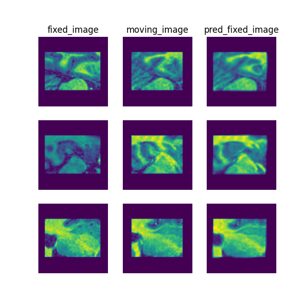

# Unpaired hippocampus MR registration

> **Note**: Please read the
> [DeepReg Demo Disclaimer](introduction.html#demo-disclaimer).

[Source Code](https://github.com/DeepRegNet/DeepReg/tree/main/demos/unpaired_mr_brain)

## Author

DeepReg Development Team (Adrià Casamitjana)

## Application

This is a demo targeting the alignment of hippocampal substructures (head and body)
using mono-modal MR images between different patients. The images are cropped around
those areas and manually annotated. This is a 3D intra-modal registration using a
composite loss of image and label similarity.

## Data

The dataset for this demo comes from the Learn2Reg MICCAI Challenge (Task 4) [1] and can
be downloaded from:
https://drive.google.com/uc?export=download&id=1RvJIjG2loU8uGkWzUuGjqVcGQW2RzNYA

## Instruction

### Installation

Please install DeepReg following the [instructions](../getting_started/install.html) and
change the current directory to the root directory of DeepReg project, i.e. `DeepReg/`.

### Download data

Please execute the following command to download/pre-process the data and download the
pre-trained model.

```bash
python demos/unpaired_mr_brain/demo_data.py
```

Pre-processing includes:

- Rescaling all images' intensity to 0-255.
- Creating and applying a binary mask to mask-out the padded values in images.
- Transforming label volumes using one-hot encoding (only for foreground classes)

### Launch demo training

Please execute the following command to launch a demo training. The training logs and
model checkpoints will be saved under `demos/unpaired_mr_brain/logs_train`.

```bash
python demos/unpaired_mr_brain/demo_train.py
```

Here the training is launched using the GPU of index 0 with a limited number of steps
and reduced size. Please add flag `--no-test` to use the original training
configuration, such as

```bash
python demos/unpaired_mr_brain/demo_train.py --no-test
```

### Predict

Please execute the following command to run the prediction with pre-trained model. The
prediction logs and visualization results will be saved under
`demos/unpaired_mr_brain/logs_predict`. Check the [CLI documentation](../docs/cli.html)
for more details about prediction output.

```bash
python demos/unpaired_mr_brain/demo_predict.py
```

## Visualise

The following command can be executed to generate a plot of three image slices from the
the fixed image, moving image and warped image (left to right) to visualise the
registration. Please see the visualisation tool docs
[here](https://github.com/DeepRegNet/DeepReg/blob/main/docs/source/docs/visualisation_tool.md)
for more visualisation options such as animated gifs.

```bash
deepreg_vis -m 2 -i 'demos/unpaired_mr_brain/logs_predict/<time-stamp>/test/<pair-number>/fixed_image.nii.gz, demos/unpaired_mr_brain/logs_predict/<time-stamp>/test/<pair-number>/moving_image.nii.gz, demos/unpaired_mr_brain/logs_predict/<time-stamp>/test/<pair-number>/pred_fixed_image.nii.gz' --slice-inds '20, 32, 44' -s demos/unpaired_mr_brain/logs_predict
```

Note: The prediction must be run before running the command to generate the
visualisation. The `<time-stamp>` and `<pair-number>` must be entered by the user.



## Contact

Please [raise an issue](https://github.com/DeepRegNet/DeepReg/issues/new/choose) for any
questions.

## Reference

[1] AL Simpson et al., _A large annotated medical image dataset for the development and
evaluation of segmentation algorithms_ (2019). https://arxiv.org/abs/1902.09063
