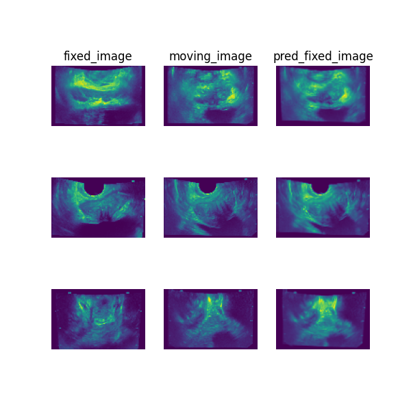

# Unpaired prostate ultrasound registration

> **Note**: Please read the
> [DeepReg Demo Disclaimer](introduction.html#demo-disclaimer).

[Source Code](https://github.com/DeepRegNet/DeepReg/tree/main/demos/unpaired_us_prostate_cv)

This DeepReg Demo is also an example of cross validation.

## Author

DeepReg Development Team

## Application

Transrectal ultrasound (TRUS) images are acquired from prostate cancer patients during
image-guided procedures. Pairwise registration between these 3D images may be useful for
intraoperative motion modelling and group-wise registration for population studies.

## Data

The 3D ultrasound images used in this demo were derived from the Prostate-MRI-US-Biopsy
dataset, hosted at the
[Cancer Imaging Archive (TCIA)](https://www.cancerimagingarchive.net/).

## Instruction

### Installation

Please install DeepReg following the [instructions](../getting_started/install.html) and
change the current directory to the root directory of DeepReg project, i.e. `DeepReg/`.

### Download data

Please execute the following command to download/pre-process the data and download the
pre-trained model. Data are split into 10 folds for cross-validation.

```bash
python demos/unpaired_us_prostate_cv/demo_data.py
```

### Launch demo training

Please execute the following command to launch a demo training (the first of the ten
runs of a 9-fold cross-validation). The training logs and model checkpoints will be
saved under `demos/unpaired_us_prostate_cv/logs_train`.

```bash
python demos/unpaired_us_prostate_cv/demo_train.py
```

Here the training is launched using the GPU of index 0 with a limited number of steps
and reduced size. Please add flag `--no-test` to use the original training
configuration, such as

```bash
python demos/unpaired_us_prostate_cv/demo_train.py --no-test
```

### Predict

Please execute the following command to run the prediction with pre-trained model. The
prediction logs and visualization results will be saved under
`demos/unpaired_us_prostate_cv/logs_predict`. Check the
[CLI documentation](../docs/cli.html) for more details about prediction output.

```bash
python demos/unpaired_us_prostate_cv/demo_predict.py
```

Optionally, the user-trained model can be used by changing the `ckpt_path` variable
inside `demo_predict.py`. Note that the path should end with `.ckpt` and checkpoints are
saved under `logs_train` as mentioned above.

## Visualise

The following command can be executed to generate a plot of three image slices from the
the moving image, warped image and fixed image (left to right) to visualise the
registration. Please see the visualisation tool docs
[here](https://github.com/DeepRegNet/DeepReg/blob/main/docs/source/docs/visualisation_tool.md)
for more visualisation options such as animated gifs.

```bash
deepreg_vis -m 2 -i 'demos/unpaired_us_prostate_cv/logs_predict/<time-stamp>/test/<pair-number>/moving_image.nii.gz, demos/unpaired_us_prostate_cv/logs_predict/<time-stamp>/test/<pair-number>/pred_fixed_image.nii.gz, demos/unpaired_us_prostate_cv/logs_predict/<time-stamp>/test/<pair-number>/fixed_image.nii.gz' --slice-inds '30, 50, 70' -s demos/unpaired_us_prostate_cv/logs_predict/
```

Note: The prediction must be run before running the command to generate the
visualisation. The `<time-stamp>` and `<pair-number>` must be entered by the user.



## Contact

Please [raise an issue](https://github.com/DeepRegNet/DeepReg/issues/new/choose) for any
questions.
