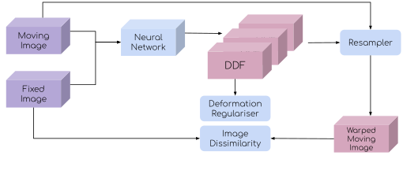
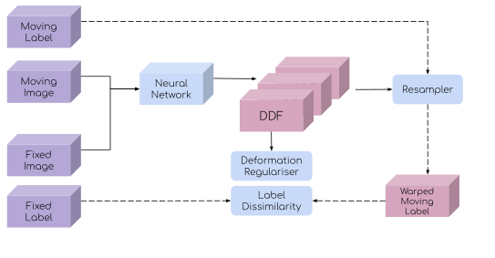
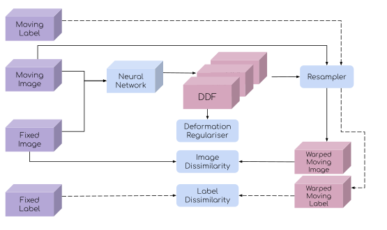

# Summary
Image fusion is a fundamental task in medical image analysis and computer-assisted intervention. Medical image registration, computational algorithms that align different images together [@hill2001medical], has in recent years turned the research attention towards deep learning. Indeed, the representation ability to learn from population data with deep neural networks has opened new possibilities for improving registration accuracy and generalisation by mitigating difficulties in designing hand-engineered image features and similarity measures for many real-world clinical applications [@haskins2020deep; @fu2020deep]. In addition, the fast inference with deep neural networks can substantially accelerate registration execution for time-critical tasks such as those in surgery and intervention.

However, popular packages focusing on deep learning methods for medical imaging, such as NiftyNet [@gibson2018niftynet] and MONAI (https://monai.io/), do not yet support image registration, while other open-source projects implementing specific published algorithms, such as the VoxelMorph [@balakrishnan2019voxelmorph], are seldom tested or designed for general research and education purposes.

*DeepReg* is a Python package that implements a class of image registration algorithms based on deep neural networks. Both unsupervised algorithms [@de2019deep] and weakly-supervised algorithms [@hu2018label] have been re-implemented. At the core of this framework is combining unsupervised losses and weak supervision, such as those derived from image similarity measures and overlap between corresponding anatomical and pathological regions of interest (ROIs), respectively. In addition, DeepReg provides command-line tool options that enable a set of basic and advanced functionalities for model training, prediction and image warping. These implementations, together with their documentation, tutorials and demos, simplify workflows for prototyping and developing novel methodology, rapid utilising latest development in this field and accessing quality research advances. A MICCAI Educational Challenge has utilised the DeepReg code and demos to explore the link between classical algorithms and deep-learning-based methods [@brown2020introduction], while a recently published research paper investigated temporal changes for prostate cancer patients under active surveillance programme, by using longitudinal image registration adapted from the DeepReg code [@yang2020longitudinal].

# Statement of need

Currently, popular packages focusing on deep learning methods for medical imaging, such as NiftyNet [@gibson2018niftynet] and MONAI (https://monai.io/), do not support image registration. Other open-source projects implementing specific published algorithms, such as the VoxelMorph [@balakrishnan2019voxelmorph], are seldom tested or designed for general research and education purposes. Therefore an open-sourced project focusing on image registration with deep learning is much needed.

# Algorithms
In this section we first summarise several standard pairwise image registration network training strategies that are implemented in the DeepReg package. The networks aim to align a pair of moving- and fixed images such that the moving image can be warped or transformed into the fixed image coordinates. The methodologies adopted in these algorithms are building blocks of many other registration tasks, such as group-wise registration and morphological template construction [@dalca2019learning; @siebert2020deep; @luo2020mvmm].

Unsupervised learning was first developed independently at a number of research groups [@de2019deep; @balakrishnan2019voxelmorph]. Image dissimilarity is measured between the fixed and warped moving images, adapted from the classical registration methods [@hill2001medical]. \autoref{fig:unsupervised} shows a schematic illustration of the unsupervised network training. Image dissimilarity measures include sum-of-squared difference in intensity, normalised cross-correlation, mutual information and their variants.

Weak supervision which utilises segmented corresponding regions in the medical image pairs was first proposed in a multimodal application [@hu2018label; @hu2018weakly]. \autoref{fig:weakly} shows a schematic illustration of the weakly-supervised network training. Label dissimilarity measures including Dice, Jaccard, mean-squared difference, cross-entropy and their multiscale formulations [@hu2018weakly].

Combining the unsupervised loss and weak supervision has shown superior registration accuracy, compared with that using unsupervised loss alone [@balakrishnan2019voxelmorph]. As a result, the overall loss is the weighted sum of the image dissimilarity, the label dissimilarity and the deformation regularisation, which encourages smoothness of the predicted transformation. \autoref{fig:combined} shows a schematic illustration of the weakly-supervised network training with unsupervised loss.

The loss functions described above are often combined with the deformation regularisation term on the predicted displacement field, ensuring the predicted deformation is smooth, including L1-, L2 norms of the displacement gradient and bending energy. Primarily predicting a general dense displacement field (DDF) from the network, other parameterised transformation models can be readily added to the DeepReg, such as rigid transformation model and free-form deformation model based on B-splines [@rueckert1999nonrigid], to further constrain the predicted transformation. As an example, DeepReg implements an affine transformation model with twelve degrees of freedom.

# Implementation
The network accepts two images as input: a fixed image, and a moving image. When available and specified, pairs of labels (here, a moving label and a fixed label, annotated from the moving and fixed images, respectively) can also be the input of the network to compute the label dissimilarity loss. A DDF can be directly predicted by the network, integrated by a predicted dense static velocity field (SVF or DVF) [@ashburner2007fast; @vercauteren2009diffeomorphic], or computed from a predicted parameterised transformation such as the affine. In the conditional segmentation algorithm, the network directly predicts the warped moving labels [@hu2019conditional].

An encoder-decoder architecture, such as an adapted U-Net and the local-net [@hu2018weakly], is used for dense prediction such as DDF and DVF. An encoder-only architecture, such as ResNet [@he2016deep] and VGG [@simonyan2014very], is used to predict the parameters of an affine transformation model. Registration networks are trained using standard minibatch gradient descent.

DeepReg currently provides six predefined _dataset loaders_ for three types of image pairs, paired, unpaired and grouped, each with two dataset loaders depending on whether corresponding labels are used. Random sampling methods are used for unpaired images. For grouped images, the groups will be sampled before random sampling of the intra-group images - a staged sampling strategy. "Groups" may mean different things, such as different subjects or patients. This staged sampling ensures unbiased learning from groups, images and labels [@hu2018weakly; @yang2020longitudinal]. When multiple labels are available and associated with each image, another staged sampling scheme will draw one pair of labels for each sampled image pair, during each training iteration.

DeepReg is unit tested and includes both technical documentation and various tutorials to introduce users to various use cases, using openly-accessible datasets. The source code and the dependencies are managed by pip and the package is listed at the Python Package Index (PyPI). The continuous integration platform TravisCI is used together with a set of customised contributor guidelines to facilitate community contributions.

# DeepReg Demos
DeepReg provides a collection of demonstrations, _DeepReg Demos_, using open-accessible data with real-world clinical applications.

## Paired images
If images are available in pairs, two dataset loaders are currently available for paired images with- and without labels. Many clinical applications for tracking organ motion and other temporal changes require _intra-subject_ _single-modality_ image registration. Registering lung CT images for the same patient, acquired at expiratory and inspiratory phases [@hering_alessa_2020_3835682], is such an example of both unsupervised (without labels) and combined supervision (trained with label dissimilarity based on segmentation of the anatomical structures). Furthermore, registering prostate MR, acquired before surgery, and the intra-operative transrectal ultrasound images is an example of weakly-supervised training for multimodal image registration [@hu2018weakly]. Another DeepReg Demo illustrates MR-to-ultrasound image registration is to track tissue deformation and brain tumour resection during neurosurgery [@xiao2017resect], in which combining unsupervised and weakly-supervised losses may be useful.

## Unpaired images
Unpaired images are found in applications such as _single-modality_ _inter-subject_ registration, also with its labelled and unlabelled dataset loaders. First, applications include registering different MR images of the brain from different subjects [@simpson2019large], which has played a fundamental role in population studies. Two other applications which register unpaired inter-subject CT images, for lung [@hering_alessa_2020_3835682] and abdominal organs [@adrian_dalca_2020_3715652]. Additionally, an example which demonstrates the support for cross-validation in DeepReg has also been included. This example registers 3D ultrasound images from different prostate cancer patients during surgical cases.

## Grouped images
Unpaired images might also be grouped in applications such as _single-modality_ _intra-subject_ registration. In this case, each subject has multiple images acquired, e.g. at two or more time points. Paired dataset loader is a special case of the grouped dataset loader. Two dataset loaders are implemented for data with- and without labels. For example, multi-sequence cardiac MR images are acquired from patients suffering from myocardial infarction [@zhuang2020cardiac] are registered, where multiple images within each subject are considered as grouped images. Prostate longitudinal MR registration is proposed to track the cancer progression during active surveillance programme [@yang2020longitudinal]. Using segmentation from this application, another demo application illustrates how the grouped dataset loader can be used for aligning intra-patient prostate gland masks - also an example of feature-based registration based on deep learning.

# Conclusion
DeepReg facilitates a collection of dataset loaders and deep learning algorithms to train image registration networks, which provides a reference of basic functionalities and performance in fields such as medical image analysis and computer-assisted intervention. In its current open-source format, DeepReg not only provides a tool for scientific research and higher education, but also welcomes contributions from wider communities above and beyond medical imaging, biomedical engineering and computer science.

# Acknowledgements

This work is supported by the Wellcome/EPSRC Centre for Interventional and Surgical Sciences (203145Z/16/Z). Support was also from the Engineering and Physical Sciences Research Council (EPSRC) (NS/A000049/1) and Wellcome Trust (203148/Z/16/Z). TV is supported by a Medtronic / Royal Academy of Engineering Research Chair (RCSRF1819\7\34). NMB, ZB, QY RD are also supported by the EPSRC CDT i4health (EP/S021930/1). ZB is supported by the Natural Sciences and Engineering Research Council of Canada Postgraduate Scholarships-Doctoral Program and the University College London Overseas and Graduate Research Scholarships.

# References
<!-- This will be filled in by references in paper.bib -->
